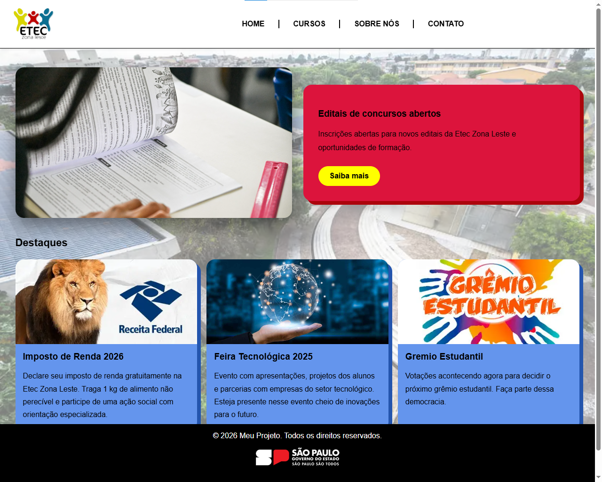
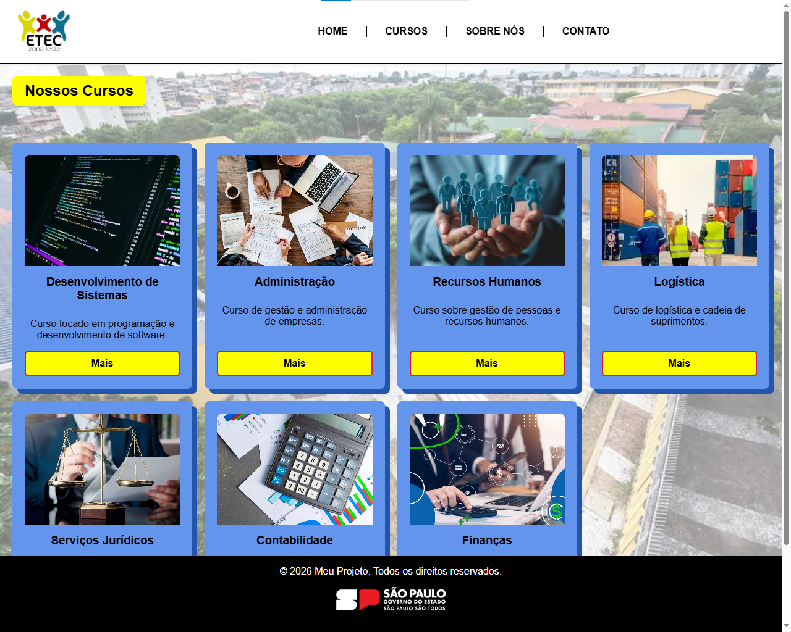
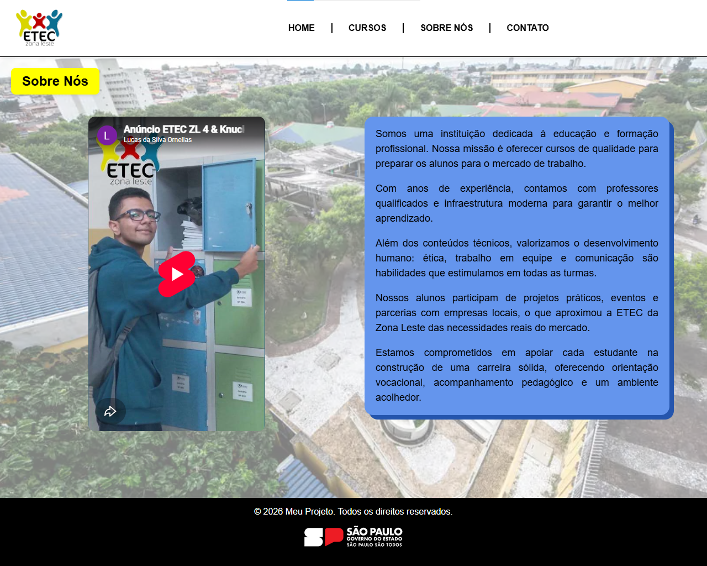
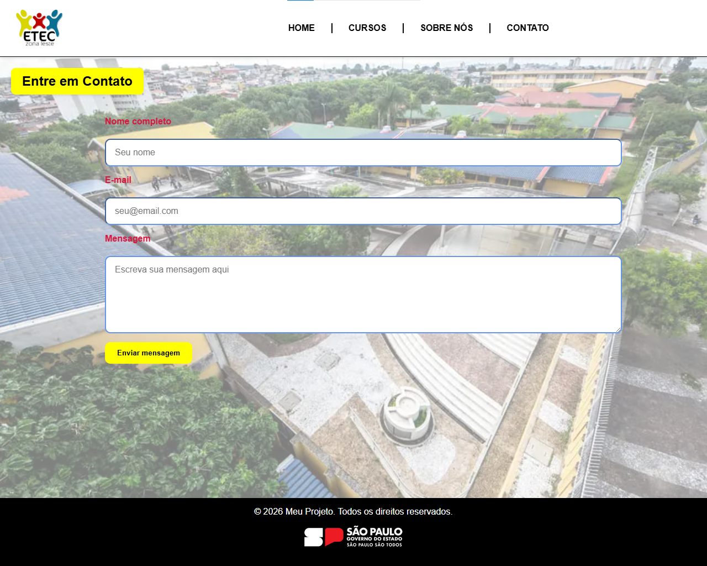

## 📖 Sobre o Projeto

Este projeto é uma aplicação web desenvolvida com **Laravel**, seguindo o padrão **MVC (Model-View-Controller)**.

---
**🧰 Tecnologias Utilizadas**
---
- **PHP (Laravel)**
- **HTML5 / CSS3**
- **JavaScript**
- **Vite**
- **Composer**
- **MySQL**
---
A proposta é criar um site da ETEC da Zona Leste com as páginas:

- Home 
- Cursos 
- Sobre nós 
- Contato 
---
Instalação
- Instale a última versão do Composer e Laravel
- Instale o xampp
- Leve o repositório do projeto ao htdocs
- Ligue o Apache e MySQL do Xampp
- Abra o repositório pelo terminal e digite: php artisan serve
- Acesse o link pelo seu navegador de preferência
- 👍
---
Lucas da Silva Ornellas - 2026
